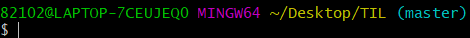

> Git 명령어 정리

## 초기설정

### 0. init

-  `git init`
- -git/ 폴더를 생성해준다

  
- .git 폴더가 생성되는 경우 오른쪽에 master라는 표시가 나온다.
- 최초에 한번만 하면 된다.

### 1. config

- `git config --global user.email "myemail@gmail.com"`

  - 이메일의 경우 깃헙에 올릴경우 잔디가 심어지는 기준이므로 정확하게 입력

- `git config --global user.name "myname"`

- 최초에 한번만 하면된다.

  

## 커밋기록

### 1. add

- `git add<추가하고싶은 파일>`
  - `git add .` : 현재 폴더의 모든 파일과 폴더를 add
- working directory => staging area로 이동

### 2. commit

- `git commit -m"메세지"`
- 스냅샷을 찍는 동작
- add 되어있는 파일들을 하나의 묶음으로 저장
- 메세지에 들어가는 내용을 기능 단위로 작성

### 3. remote 

- `git remote add origin <주소>`
- 원격 저장소와 현재 로컬 저장소를 연결
- 한번만 진행

### 4. push

- `git push origin master`
- 깃아 올려줘 origin으로 master를
- 원격저장소에 로컬저장소의 데이터를 전송

## 상태확인

### 1. status

- `git status`
- 현재 git 상태를 출력

### 2. log

- `git log`
- 커밋기록을 전체 다 출력
- 옵션
  - `--oneline` : author, date 같은 정보를 제외하고 한줄로 출력
  - `--graph` : 커밋들을 점으로 표현하고 그 커밋을 선으로 연결해서 그래프 형태로 출력

### 3. diff

- `git diff`

- 현재 변경사항을 체크(add 하기전에 체크)

  

## 추가파일

### 1. gitignore

- `gitignore` 파일을 생성 후 git으로 관리하고 싶지 않은 파일들을 저장

- gitignore.io

  

## 브랜치

### 1. 생성

- `git branch <브랜치이름>`

### 2. 이동

- `git switch <브랜치이름>` => 최신문법
- `git checkout <브랜치이름>` => 예전문법

### 3. 삭제

- `git branch <브랜치이름>`

### 4. 병합

- `git merge <브랜치이름>`
- base가 되는 branch로 이동해서 명령어 사용
  - feature branch를 master에 합치고 싶은 경우 master로 이동해서 명령
- 충돌이 발생한 경우 => 충돌을 해결하고 다시 add commit push

## 취소 및 삭제

### 1. rm -rf

- `rm -rf .파일명`
- rm => 지워줘(remove)
- r => 내부의 폴더들도 다같이(recusive)
- f => 강제로(force)
  - f는 생략해도 무방

### 2. git add 취소

- `git reset` 전체 파일 add 취소
- `git reset HEAD` 특정 파일 add 취소

### 3. git commit 취소

- `git reset HEAD^` 가장 최신 커밋 1개 취소(삭제)
- `git reset HEAD^^` 가장 최신 커밋 2개 취소(삭제)
- 꺽쇠 갯수에 따라 최신 커밋을 필요한만큼 순서대로 삭제할 수 있음

